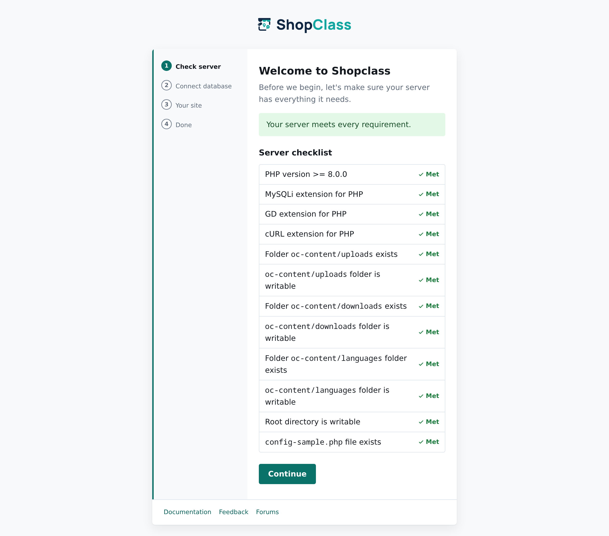
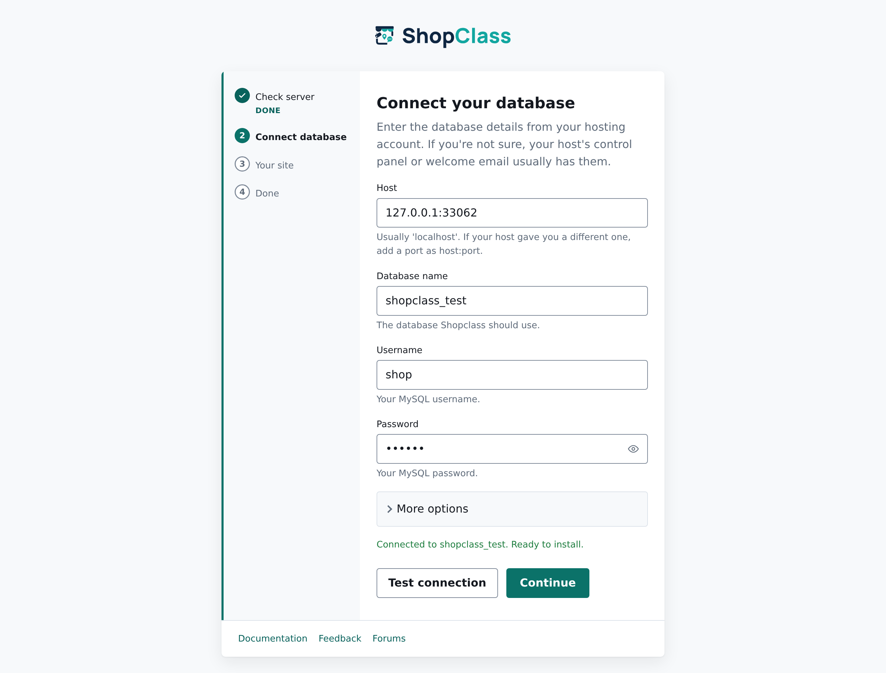
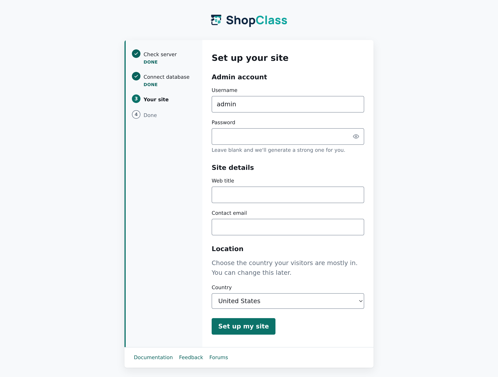
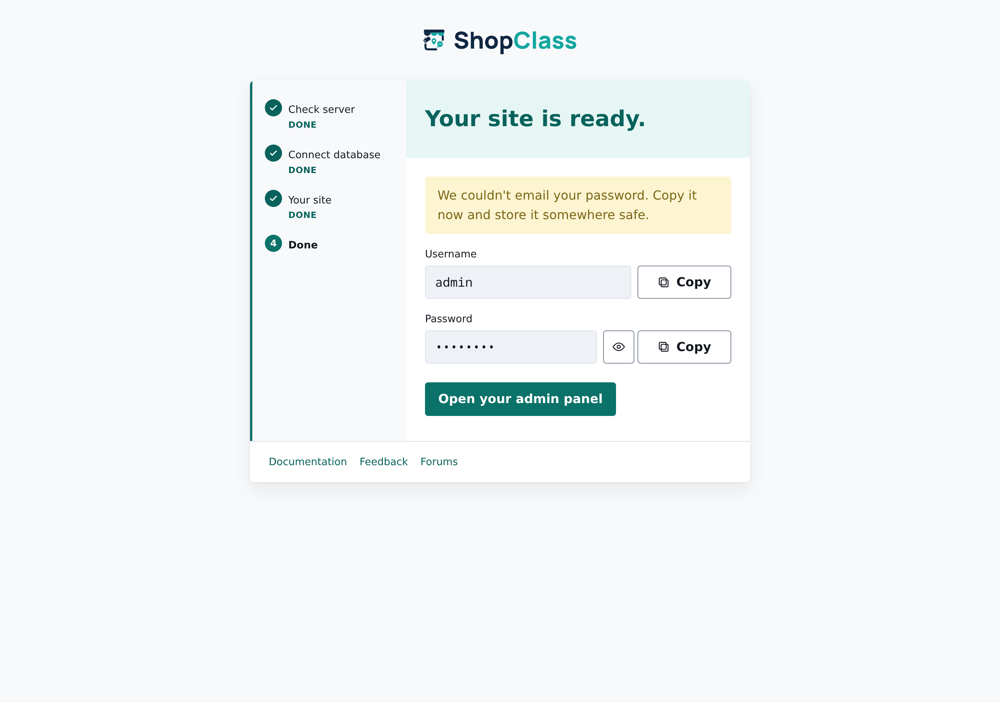

<p align="center">
  <a href="https://github.com/mindstellar/shopclass-brand">
    
  </a>
</p>

<p align="center">
  <strong>Open-source, self-hosted classifieds — by Mindstellar.</strong><br>
  Build and run your own ads marketplace: real estate, jobs, vehicles, anything.
</p>

<p align="center">
  <a href="https://github.com/mindstellar/shopclass/blob/master/LICENSE"></a>
  <a href="https://github.com/mindstellar/shopclass/actions/workflows/test.yml"></a>
  <a href="https://github.com/mindstellar/shopclass/releases/latest"></a>
  
  <a href="https://github.com/mindstellar/shopclass/stargazers"></a>
</p>

---

## What is Shopclass?

Shopclass is a PHP application that lets you launch a full classifieds website on
your own hosting — listings with photos, categories and locations, user accounts,
comments, search and filtering, multi-language support, and an admin panel to run
it all. It ships as a zip you install on ordinary shared or VPS hosting; there is
no build step or bundler to run on the server.

Shopclass is the modernised, community-maintained successor to **Osclass**. It
keeps Osclass's plugin and theme APIs (the `osc_*` helpers, hook names, and asset
paths) so existing extensions keep working, while replacing the legacy frontend:
a Bootstrap 5 admin theme, jQuery removed from the core, PHP 8 throughout, and a
first-class maintenance/cleanup toolset built in.

## Features

- 🗂️ Listings with photos, categories, and hierarchical locations
- 🔍 Search, filtering, and SEO-friendly URLs
- 👥 User registration, accounts, and moderation
- 🎨 Themeable frontend + a modern, accessible (WCAG-checked) admin panel
- 🧩 Plugin & theme system — compatible with the Osclass extension API
- 🌎 Multi-language / i18n support
- 🔒 CSRF protection, CAPTCHA, and hardened sessions
- 🧹 Built-in Tools → Cleanup for expired, spam, blocked, and unactivated content
- ♻️ One-click self-updater that pulls release packages

## Requirements

- PHP **8.0+** with `mysqli`, `gd`, `curl`, `mbstring`, `openssl`, `zip`, `json`,
  `ctype`, `fileinfo`, and `posix`
- MySQL 5.7+ / MariaDB 10.2+
- Any web server (Apache or nginx)

## Install

> Deploy from a **release zip**, never from a branch — `master`/`develop` may
> contain untested code, and releases carry the compiled CSS/JS the branches
> don't rebuild for you.

1. Download the latest package from the [**Releases**](https://github.com/mindstellar/shopclass/releases) page and unpack it into your web root (e.g. `public_html`).
2. Open your site in a browser — `https://example.com/` — and the installer starts automatically (or go straight to `oc-includes/osclass/install.php`).
3. Follow the four steps below.
4. Sign in at `https://example.com/oc-admin/` with the admin password shown on the final screen.

### The installer, step by step

**1 · Check server** — the installer confirms your PHP version, extensions and folder permissions up front, so nothing fails halfway through.



**2 · Connect database** — enter the details from your hosting panel and press **Test connection** to confirm they work *before* anything is written. A database on a non-default port can be entered as `host:port`.



**3 · Your site** — pick an admin username (leave the password blank and a strong one is generated for you), your site title, contact e-mail and country.



**4 · Done** — copy your admin password (it's also e-mailed to you) and open the admin panel.



The installer runs once; if the site is already set up it shows a short notice instead of re-running.

## Local development

The runtime needs no build tools, but the admin theme's CSS/JS are compiled from
source. You only need Node to work on them.

```bash
git clone --recursive git@github.com:mindstellar/shopclass.git
cd shopclass
npm install
npm run build        # vendor assets + SCSS → CSS + JS
npm run watch        # rebuild CSS on change while developing
```

Compiled output (`oc-admin/themes/modern/css/main.css`, `oc-includes/assets/…`)
is **committed** — releases are cut with `git archive`, so whatever is committed
is exactly what users receive. Rebuild and commit the output with any SCSS/JS
change.

### Run it with Docker

A full local stack — PHP-FPM, MariaDB, Nginx, Memcached, Mailhog and phpMyAdmin —
ships in `docker-compose.yml`:

```bash
docker compose up -d --build
```

Then open **http://localhost:8000** and run the installer with these database
details (leave the admin password blank on step 3 for a generated one):

| Field | Value |
|---|---|
| Host | `mariadb` |
| Database | `shopclass` |
| User | `shopclass` |
| Password | `shopclass` |

Outgoing e-mail — including the installer's welcome message — is caught by
**Mailhog**, so you can read it in a browser instead of it silently failing.

| Service | Address |
|---|---|
| Site | http://localhost:8000 |
| Mailhog inbox | http://localhost:8025 |
| phpMyAdmin | http://localhost:8081 (root / `root`) |
| MariaDB (from host) | `127.0.0.1:3307` |

Inside the compose network the services resolve as `php-fpm:9000`,
`mariadb:3306`, `memcached:11211`, and `mailhog:1025`. Override the database name and
credentials with the `SHOPCLASS_DATABASE_NAME` / `SHOPCLASS_DATABASE_USER` /
`SHOPCLASS_DATABASE_PASSWORD` variables and the root password with
`MYSQL_ROOT_PASSWORD` (export them, or put them in a `.env` file next to the
compose file).

## Brand

Logos, the mark, the favicon set, and the palette live in the
[**shopclass-brand**](https://github.com/mindstellar/shopclass-brand) repository.

| Role | Color | Hex |
|---|---|---|
| Deep Navy | dark / headings | `#0F2742` |
| Teal | brand / identity | `#12A6A0` |
| Slate Gray | neutral | `#435466` |
| Warm Off-White | surface | `#F7F5F1` |
| Coral | accent | `#FF6B4A` |

Brand assets are licensed **CC BY-ND 4.0**: use them to refer to Shopclass, but
please don't modify the marks or imply endorsement.

## Contributing

Contributions are welcome — bug fixes, features, translations, docs.

1. Open an issue describing the change before you start.
2. Branch from **`develop`** (never target `master`).
3. Make your change; if it touches the admin theme, run `npm run build` and commit the compiled output.
4. Open a pull request against `develop`.

Because Shopclass runs on installs with third-party themes and plugins, treat the
`osc_*` helpers, hook names, admin CSS class names, and `oc-includes/assets/`
paths as a public API — restyle freely, but don't rename or remove them.

## Support

Questions, help, and discussion happen on
[**GitHub Discussions**](https://github.com/mindstellar/shopclass/discussions).
For reproducible bugs, open an [issue](https://github.com/mindstellar/shopclass/issues).

## License

Shopclass is distributed under the **GNU General Public License v3.0 or later**
([LICENSE](LICENSE)). It derives from Osclass, whose original code is licensed
under the **Apache License 2.0** ([LICENSE-APACHE](LICENSE-APACHE)); those
notices are retained in [NOTICE](NOTICE) as that license requires.

## Links

- 📦 [Releases](https://github.com/mindstellar/shopclass/releases)
- 🐛 [Issues](https://github.com/mindstellar/shopclass/issues)
- 💬 [Discussions](https://github.com/mindstellar/shopclass/discussions)
- 🎨 [Brand kit](https://github.com/mindstellar/shopclass-brand)
