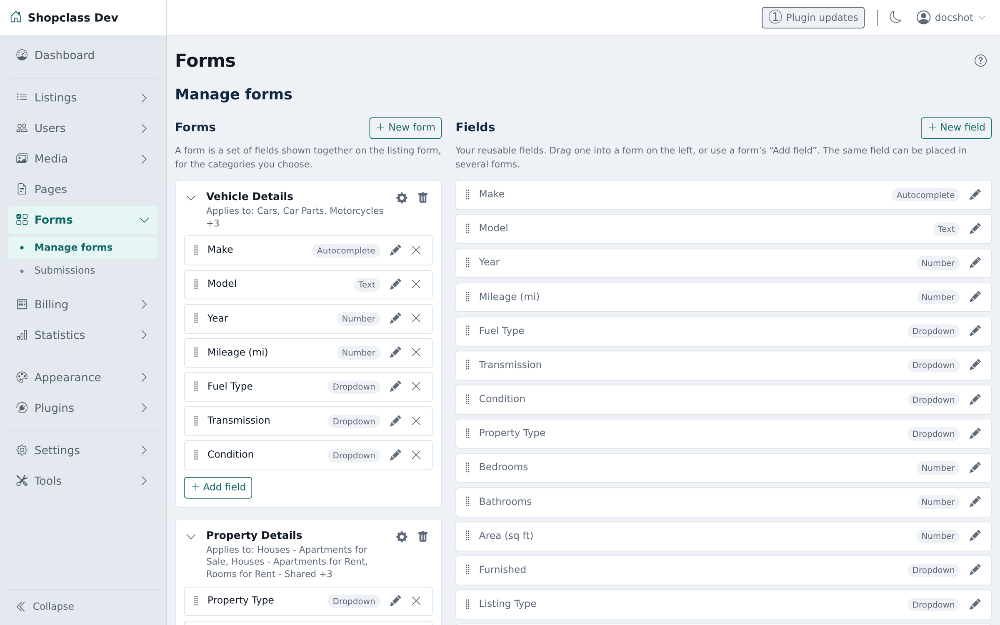
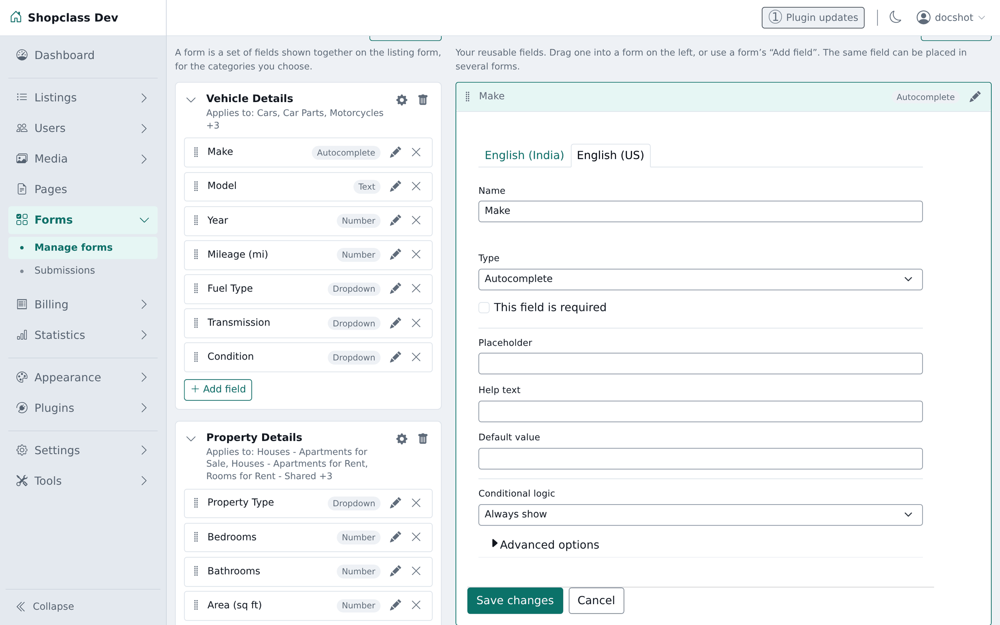
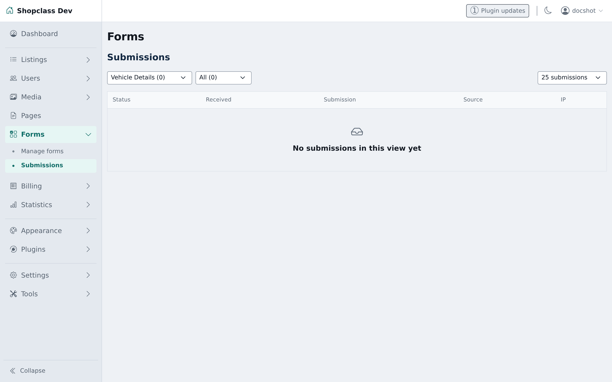

A car listing needs Make, Model, Year and Mileage. A flat needs Bedrooms, Floor
and Furnished. A job needs Salary and Contract type. ShopClass models all of
that without code, through **fields** grouped into **forms**.

**Forms** in the admin panel.

## The model, in three parts

**Fields** are the individual inputs — *Make*, *Year*, *Fuel type*. A field is
defined once and is **reusable**: the same *Year* field can sit in your Cars
form and your Motorbikes form.

**Forms** are ordered groups of fields — *Vehicle details*, *Property details*.

**Listings → Categories** are what a form is attached to. A form applies to one or more
categories, and its fields then appear when publishing in those categories, and
as filters when browsing them.

:::caution[A form attached to no category does nothing]
The admin flags it: *"Not attached to a category — it won't appear on listings
yet."* Creating the form is only half the job.
:::

## Creating a form

**Forms → Manage forms** is a two-panel builder: your forms on the left, your
reusable fields on the right.

1. Press **+ New form** and name it.
2. Drag fields in from the **Fields** panel on the right, or use the form's
   **+ Add field** to make a new one.
3. Drag to reorder — this is the order visitors see. Fields can also be reordered
   from the keyboard: focus the grip and use the arrow keys.
4. Open the form's **settings** (the gear) to attach it to the categories it
   applies to. Each form shows its **Applies to:** line underneath.

## Field types

| Type | Use for |
|---|---|
| **Text** | Short free text. Configurable placeholder, help text, default, max length, and a regex pattern. |
| **Text area** | Long text. Configurable rows. |
| **Number** | Numeric values, with min, max and step. |
| **Dropdown** | One choice from a list. |
| **Radio buttons** | One choice, all options visible. |
| **Checkbox** | A single yes/no. |
| **URL** | A link, optionally opening in a new tab. |
| **Date** | A single date. |
| **Date range** | A period with a start and an end. |
| **Email** | An address, validated as one. |
| **Phone** | A telephone number. |
| **Autocomplete** | Text with suggestions, with a configurable minimum length before suggesting. |

Plugins can register further types, which appear in the picker alongside these.

Choose the narrowest type that fits. A **Number** for Year gives you numeric
filtering and sorting; the same thing as **Text** gives you neither, and sorts
`1998` after `10000`.

Editing a field opens its settings beside the form:

- **Name** has a tab per active language. The default locale is required; see
  [languages](/docs/use/languages/).
- **This field is required** makes it mandatory on the publish form.
- **Placeholder**, **Help text** and **Default value** are what turn a bare input
  into one a seller can answer without guessing.
- **Advanced options** holds the rest, including *Tick to allow searches by this
  field* — see [making fields searchable](#making-fields-searchable) — and, for a
  URL field, *Tick to open links in new tab*.

## Reused fields change everywhere

The admin says so when you edit one: *"Editing this field changes it in every
form that uses it."* A field's card shows how many forms it appears in.

That is the point — one *Year* field means one consistent set of values across
every vehicle category. But rename it or change its options and every form
using it changes at once.

If you need a variation, create a separate field rather than editing the shared
one.

## Conditional logic

Every field carries a **Conditional logic** setting with three modes:

| Mode | Effect |
|---|---|
| **Always show** | The default. The field is on the form for everyone. |
| **Show only when…** | The field appears only when another field matches a condition — show *Engine size* only when *Fuel type* is not *Electric*. |
| **Required only when…** | The field is always visible, but only mandatory when the condition matches — make *Registration number* required only when *Condition* is *Used*. |

The available conditions are **is**, **is not**, **is greater than**, **is less
than** and **is filled**.

*Required only when* is the one people miss. It is how you demand the detail that
matters for one kind of listing without blocking every other kind.

This is how you keep a publish form short. A form with forty fields, most
irrelevant to any given listing, is abandoned; a form that reveals the next
question based on the last one is not.

## Inheritance down the category tree

A form attached to a parent category applies to its children too. Attach
*Vehicle details* to **Vehicles** and it covers Cars, Motorbikes and Vans
without attaching it three times.

Attach the shared fields high and the specific ones low.

## Legacy fields from before Forms

Fields attached directly to categories — the older Osclass model — still work.
The admin marks them with a **"n cats · no form"** badge and explains: *attached
directly to n categories, outside any form. Drag it into a form to manage it
here.*

They are live on those listings, just invisible to the forms interface. Dragging
one into a form brings it under management without disturbing the data already
captured against it.

There is no deadline to do this, but doing it means one place to look.

## Form submissions

A form can also be placed on a **page** to collect enquiries rather than to
describe a listing — a contact form, an application, a request form.

**Forms → Submissions** shows what has come in.

 Each submission carries who sent
it (if they were logged in), their IP, when it arrived, and a status of **New**,
**Read** or **Spam**.

Submissions are stored in the database, not e-mailed away and forgotten, so
nothing is lost if mail delivery fails.

Deleting a form deletes the submissions made through it. Export anything you
need to keep first.

## Changing a field after listings use it

Existing values are kept, but the consequences differ by change:

- **Renaming a field** is safe — the stored values are untouched.
- **Removing an option** from a dropdown leaves listings holding a value that is
  no longer offered. They keep it and display it; nobody can select it again.
- **Changing a field's type** may make existing values unreadable by the new
  type. Add a new field instead and retire the old one.
- **Deleting a field** deletes its values from every listing. There is no undo.

## Making fields searchable

A field is only useful as a filter if search knows about it. In the field's
**Advanced options**, tick **"Tick to allow searches by this field"** for the
fields you want visitors to narrow by — price ranges, year, bedrooms — and leave descriptive
fields unmarked. Every searchable field is another query cost and another control
in the sidebar, so choose the two or three that actually change what people find.
